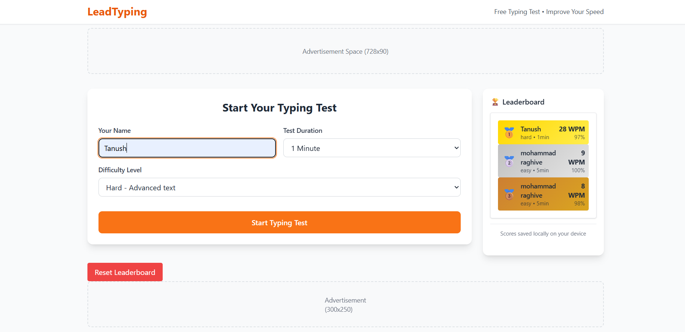
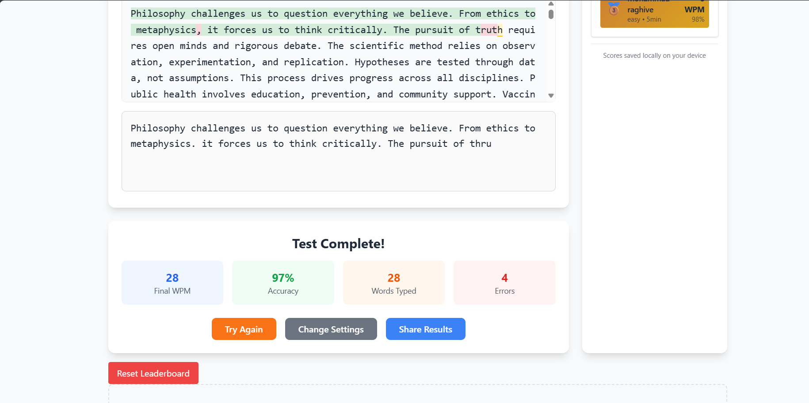

# ⌨️ LeadTyping

**LeadTyping** is a clean and interactive typing speed test web app that helps users improve their typing skills through engaging UI, real-time feedback, and performance tracking.

  

---

## 🚀 Live Demo

🔗 [Visit LeadTyping on GitHub Pages](https://tanush-afk052.github.io/Lead-Typing/)  

---

## 🧩 Features

- ⌨️ Real-time typing test with highlighted input
- ⚡ Words Per Minute (WPM), accuracy, and time tracking
- 🧠 Difficulty levels: Easy, Medium, Hard
- 🎨 Clean UI with modern animations
- 📊 Session performance summary
- 📁 Local leaderboard tracking (on your device)
- 🔄 Reset & retry functionality

---

## 🛠️ Tech Stack

| Tech         | Purpose                      |
|--------------|------------------------------|
| HTML5        | Structure                    |
| CSS3         | Styling & Animations         |
| JavaScript   | Logic, Timer, Interactivity  |
| LocalStorage | Score storage (offline)      |

---

## 🖼️ Screenshots

| Typing Area | Results Summary |
|-------------|-----------------|
|  |  |

---

## 🧪 How to Use

1. Open the web in your browser.
2. Click Take A Test
3. Select difficulty (Easy/Medium/Hard).
4. Start typing when the test begins.
5. View results at the end: WPM, Accuracy, Time.
6. Retry or improve your score!

---

